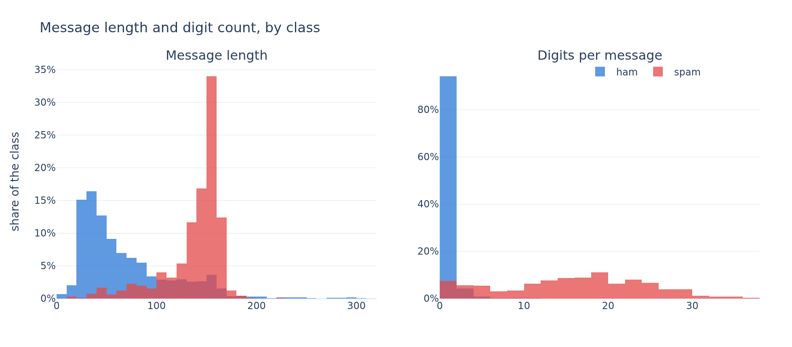
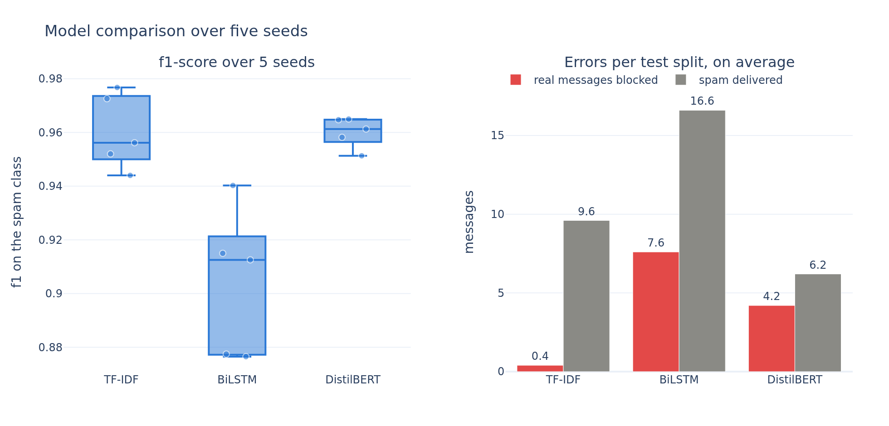

# Can a spam filter be worth 67 million parameters?

An SMS spam detector built for AT&T, who flag spam by hand and want it automated.

Jedha *Full Stack Data Scientist* — **Block 4, Deep Learning Project** (AT&T spam detector).
PyTorch, HuggingFace transformers, scikit-learn.

The full analysis, with every protocol decision and its measured cost, is in
[`spam_detector_project.ipynb`](spam_detector_project.ipynb).

## The problem

The brief asks for a deep learning model that decides, from the text alone, whether an SMS is
spam — and it gives two hints: *start simple*, and *transfer learning might help*. This notebook
takes both literally and measures them, by training three models on the same 5 169 messages and
scoring them the same way:

| | what it is | parameters |
|---|---|---|
| **Reference** | TF-IDF on character n-grams + a linear SVM — not deep learning at all | a matrix |
| **From scratch** | an embedding layer + a bidirectional LSTM, learned from these messages only | 0.6 M |
| **Transfer** | `distilbert-base-uncased`, pretrained on 3 billion words, fine-tuned here | 67 M |

## The dataset

`data/spam.csv` — 5 572 SMS labelled `ham` or `spam`, **13.4% of them spam**. Two things about the
file decide what a score means, and both are settled before any model is trained:

- **The three `Unnamed` columns are not debris — they are the end of 50 messages.** The file is a
  CSV of unescaped text, so every message containing a comma inside a quote was split across the
  extra columns. Dropping them, which is the usual first line of every tutorial, throws away **40%
  of the text of those messages** (92 characters kept out of 156) — and it truncates them exactly where the
  phone number and the price live. They are put back together.
- **403 messages are exact duplicates, and a naive split puts them on both sides.** One test
  message in nine (11.6%) is a verbatim copy of a training message, and the model is **perfect** on
  those and 0.956 on the rest: it is being graded on its memory. The messages are deduplicated
  before the split, which leaves **5 169**.

Neither decision is worth a point of score — the four possible protocols land within 0.005 f1 of
each other. They change what the number *means*, not what it is, and the notebook says so rather than claiming a gain.

## The metric

13% spam, so accuracy is meaningless — answering "ham" to everything is right 87% of the time.
Every score is the **f1-score of the spam class**. The two errors are kept separate throughout,
because for a carrier they are not symmetric: a **false negative** is a spam that reaches the
customer, a **false positive** is a real message from a real person that AT&T withheld.

## What we found

### What a spam SMS looks like



A spam SMS is **138 characters against 71** for a real one, and carries **15 digits against 0.3**.

### The comparison over five seeds



Five seeds, each one re-splitting and re-training all three models:

| Model | f1 | std | real messages blocked | spam delivered |
|---|---|---|---|---|
| TF-IDF + linear SVM | **0.9603** | 0.0139 | **0.4** | 9.6 |
| BiLSTM from scratch | 0.9043 | 0.0272 | 7.6 | 16.6 |
| DistilBERT fine-tuned | **0.9601** | 0.0056 | 4.2 | **6.2** |

- **The network trained from scratch loses to the linear model by six points.** It has 583 170
  parameters, 384 000 of them an embedding table, and 4 135 messages to learn them from.
- **DistilBERT ties the linear model on f1** — the gap between the means is smaller than one
  standard deviation of either. What it buys is a different error profile: three fewer spams
  delivered per split, ten times more real messages blocked.

## What AT&T should deploy

| | f1 | size | one SMS |
|---|---|---|---|
| TF-IDF + linear SVM | 0.9603 | 0.9 MB | **1.17 ms** (CPU) |
| DistilBERT fine-tuned | 0.9601 | 268 MB | 4.10 ms (GPU) / **14 ms** (CPU) |

1. **Deploy the linear model.** f1 0.96 on messages it has never seen, essentially no legitimate
   message blocked, trains in under a second, weighs a megabyte, scores an SMS in about a
   millisecond on one CPU core, needs no accelerator anywhere in the stack.
2. **DistilBERT is worth it only if AT&T cares more about the spam it misses than about the real
   messages it blocks.** Over the five splits, it lets through about 3 fewer spams per split and
   blocks about 4 more real messages. It also weighs 268 MB against 0.9 MB, and is slower per
   message.
3. **The deep learning result worth stating is a negative one:** on 4 135 messages, a network
   trained from scratch is beaten by TF-IDF. DistilBERT closes that gap, but it is both a far larger
   transformer and pretrained on 3 billion words.
4. **What would move the score is not a bigger model.** Two things could help, neither tested
   here. More spam examples in the training set: AT&T already flags spam by hand, so the model
   can be retrained regularly on what it flags. And information this file does not contain — the
   sender, the time, whether the same text went to ten thousand handsets in one minute.

## Reproducing

```bash
python3 -m venv .venv
.venv/bin/pip install -r requirements.txt
```

Then open `spam_detector_project.ipynb` and select the `.venv` kernel. The notebook reads
`data/spam.csv` and downloads `distilbert-base-uncased` from the HuggingFace hub on first run
(~268 MB, cached afterwards); nothing else leaves the machine.

It runs in **about 4 minutes on a GPU** (measured on an RTX 3090 Ti) and about 20 on a CPU — the
five-seed comparison in section 7 trains fifteen models. `RANDOM_STATE = 42` seeds every split and
every initialisation, but GPU kernels are not bit-deterministic, so a re-run can move the third
decimal of a single model. That is why the comparison is built on five seeds rather than one.

If `kaleido` cannot find a browser for the charts, run `.venv/bin/plotly_get_chrome`.

## Layout

```
spam_detector_project.ipynb   the analysis — sections 1 to 8
data/spam.csv                 5 572 labelled SMS
images/                       the two charts, also embedded in the notebook
requirements.txt              pinned versions
```
